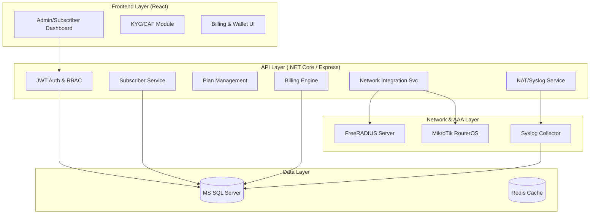
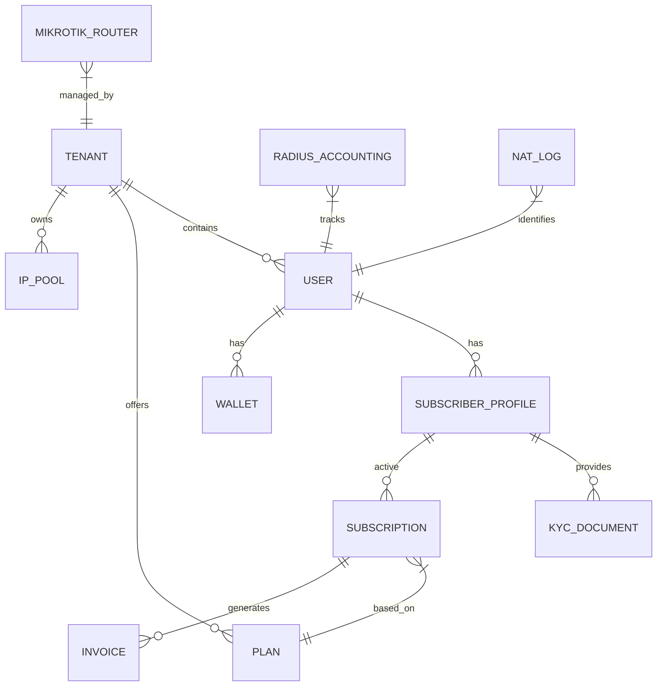

# NetPulse ISP Management Platform - System Architecture

## 1. System Overview
The NetPulse platform is a high-performance, multi-tenant solution designed for ISPs to manage subscribers, network infrastructure, and billing.

## 2. Full System Architecture Diagram

## 3. Entity Relationship Diagram (ERD)

## 4. Multi-Tenant Role Hierarchy
1. **Master Admin**: Global configuration, Tenant (ISP) creation, Global Reports.
2. **ISP Admin**: Manage Franchise/LCO, IP Pools, Global Plans for their ISP.
3. **Franchise Admin**: Manage LCOs, Subscribers, Revenue Share.
4. **LCO Admin**: Local Subscriber management, Support, Collection.
5. **Subscriber**: Self-care, Recharge, Usage stats, Support tickets.
